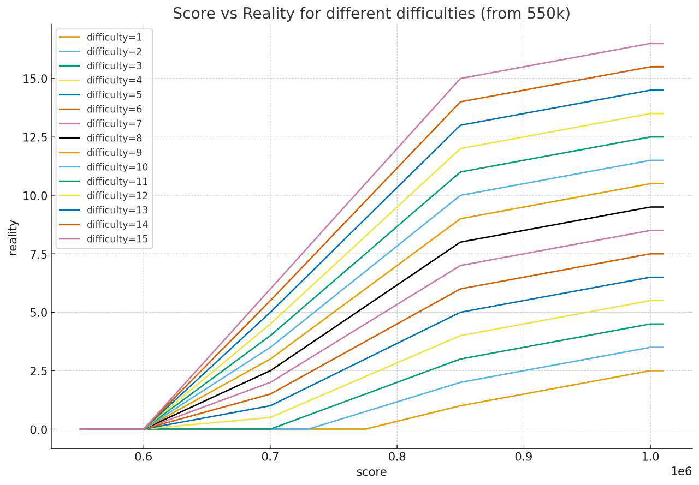

# Milthm Reality

Go module `milthm.dev/reality/v3` for computing reality scores based on song records.

## Features

* Compute individual record ratings from song difficulty and player score.
* Aggregate up to 20 top ratings into a single reality score.

## Installation

```bash
go get milthm.dev/reality/v3
```

## Usage

```go
import (
    "fmt"
    "milthm.dev/reality/v2"
)

func main() {
    // Implement ScoreRecorder and ChartInformationRepository interfaces
    total, err := reality.CalculateReality(scores, repo)
    if err != nil {
        fmt.Println("Error:", err)
        return
    }
    fmt.Println("Total reality:", total)
}
```

## Plot

